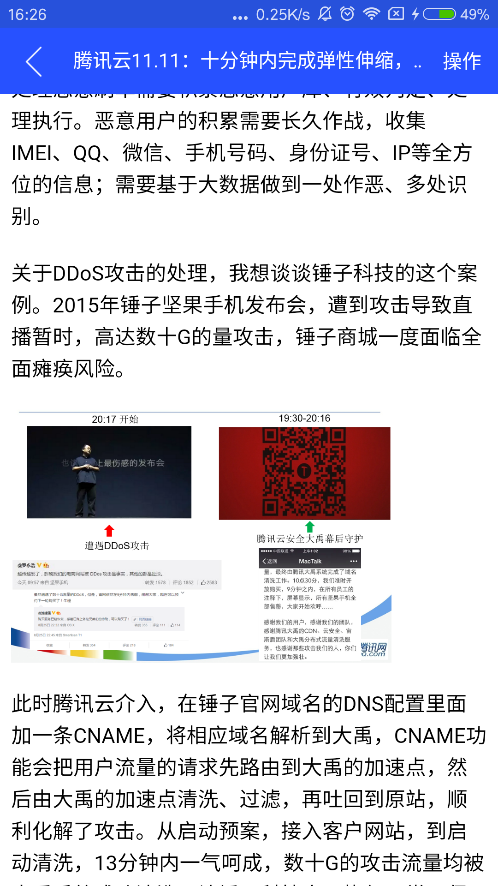
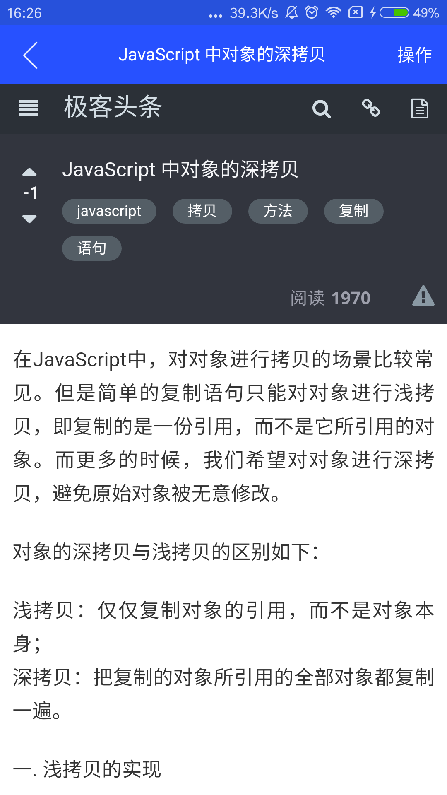
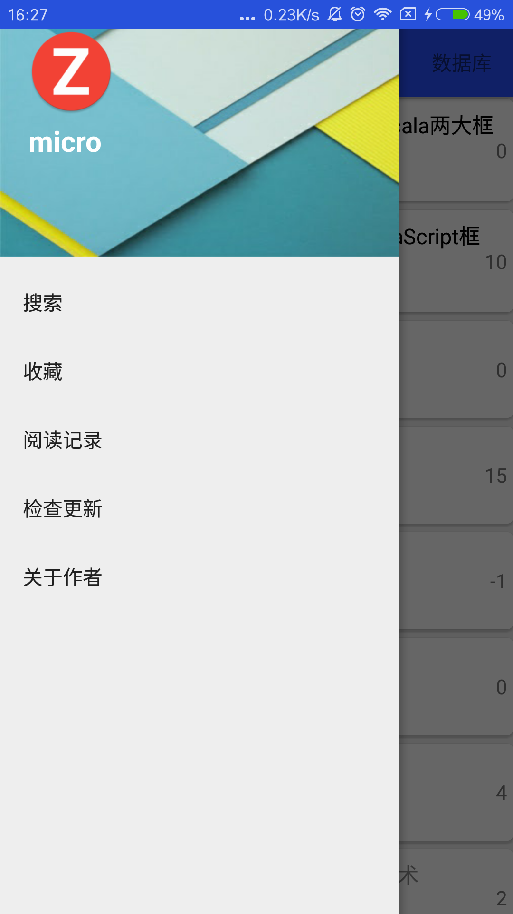

 
# 1.关于本软件
   MicroBlog 是我在业余时间做的一款小软件，主要综合了国内了几个大的科技博客网站：INFOQ、ITEYE、CSDN、OSChina、泡在网上的日子的网站源码，使用Jsoup类解析成对象，然后展示界面： 
   
   &nbsp;&nbsp;
   &nbsp;&nbsp;
   &nbsp;&nbsp;
   

   &nbsp;&nbsp;
   &nbsp;&nbsp;
   &nbsp;&nbsp;
   通过本软件，你可以尝试不同博客网站的博客内容，也提供了搜索功能，收藏功能，阅读记录功能，分享功能等等。。
   由于刚开始是菜鸟，再加上呆在创业公司，很大一部分时间在讨论业务逻辑，所以技术不是特别好，代码也也写不够好，这里只是给大家一个思路，通过这个app也是一个练手的想法。
   
# 2.主要用到的技术
   由于从事开发android的时间不长，也不是很懂android高深的技术，主要包括RxJava + Retrofit2.0 + Glide + ormlite + jsoup + MVP模式，很多代码是参考别人的，在此表示感谢：<a href='http://blog.csdn.net/brian512/article/details/51558809'>年少的风</a> , <a href='https://github.com/jaydenxiao2016/AndroidFire'>androidFire</a> 在此表示感谢。
   
   
# 3.所用的接口[就是抓包网站的网址，高大上一点哦]
   infoQ :
   架构：http://www.infoq.com/cn/architecture-design/articles/
   移动：http://www.infoq.com/cn/mobile/articles/
   云计算：http://www.infoq.com/cn/cloud-computing/articles/
   大数据：http://www.infoq.com/cn/bigdata/articles/  
   运维：http://www.infoq.com/cn/operation/articles/

    ITEYE:
    资讯：http://www.iteye.com/news
    精华：http://www.iteye.com/magazines
    博客：http://www.iteye.com/blogs
    专栏：http://www.iteye.com/blogs/subjects

    CSDN
    前端
    http://geek.csdn.net/service/news/get_category_news_list?category_id=frontend& jsonpcallback=jQuery20309836559783031329_1479717830080&username=u013762572&from=20&size=20&type=category&_=1479717830081

   移动
   http://geek.csdn.net/service/news/get_category_news_list?category_id=mobile&jsonpcallback=jQuery20301528046427485552_1479717874823&username=u013762572&from=0&size=20&type=category&_=1479717874824

   云计算
   http://geek.csdn.net/service/news/get_category_news_list?category_id=cloud&jsonpcallback=jQuery20307511375457787082_1479717658917&username=u013762572&from=20&size=20&type=category&_=1479717658918

   大数据
   http://geek.csdn.net/service/news/get_category_news_list?category_id=bigdata&jsonpcallback=jQuery20307133938887790177_1479717696246&username=u013762572&from=20&size=20&type=category&_=1479717696247

   数据库
   http://geek.csdn.net/service/news/get_category_news_list?category_id=database&jsonpcallback=jQuery20307188289349209822_1479717786436&username=u013762572&from=20&size=20&type=category&_=1479717786437

   泡在网上的日子：
   综合资讯：http://www.jcodecraeer.com/plus/list.php?tid=4
   程序设计：http://www.jcodecraeer.com/plus/list.php?tid=6
   安卓开发：http://www.jcodecraeer.com/plus/list.php?tid=16
   前端开发：http://www.jcodecraeer.com/plus/list.php?tid=5
   IOS开发： http://www.jcodecraeer.com/plus/list.php?tid=27

   OSC:
   全部：https://www.oschina.net/action/ajax/get_more_recommend_blog?classification=0&p=2
   移动  https://www.oschina.net/action/ajax/get_more_recommend_blog?classification=428602&p=2
   前端：https://www.oschina.net/action/ajax/get_more_recommend_blog?classification=428612&p=2
   服务器：https://www.oschina.net/action/ajax/get_more_recommend_blog?classification==428640&2
   游戏开发：https://www.oschina.net/action/ajax/get_more_recommend_blog?classification=429511&p=2
   编程语言：https://www.oschina.net/action/ajax/get_more_recommend_blog?classification=428609&p=2
   
# 4. other
   本人博客：<a href='http://blog.csdn.net/u013762572'>MicroHx</a>
   邮箱：javainstalling@163.com
   
   我会持续维护这个博客，会及时把学到的技术运用到上面，谢谢大家关注。   
